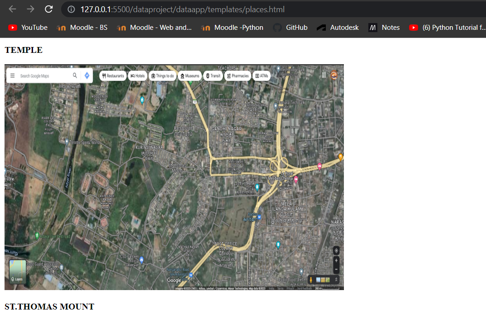

# Places Around Me
# Aim:
To develop a website to display details about the places around my house.

# Design Steps:
## Step 1:
Create a HTML file and add the images using img tag

## Step 2:
Describe about the images(places).

## Step 3:
Commit the changes using git commands and upload the file to your github account.

# Code:
```
<!DOCTYPE html>
<html lang="en">
<head>
    <meta charset="UTF-8">
    <meta http-equiv="X-UA-Compatible" content="IE=edge">
    <meta name="viewport" content="width=device-width, initial-scale=1.0">
    <title>Document</title>
</head>
<body>
    <h1>Famous Places Around my Place</h1>
    
    <p><b>AIRPORT</b></p>
    
    <p><b>PARK</b></p>
    
    <p><b>TEMPLE</b></p>
    
    <p><b>ST.THOMAS MOUNT</b></p>
    
    <p><b>VETRI CINEMAS</b></p>
</body>
</html>
```
# Output:





# Result:
The program is executed Successfully.